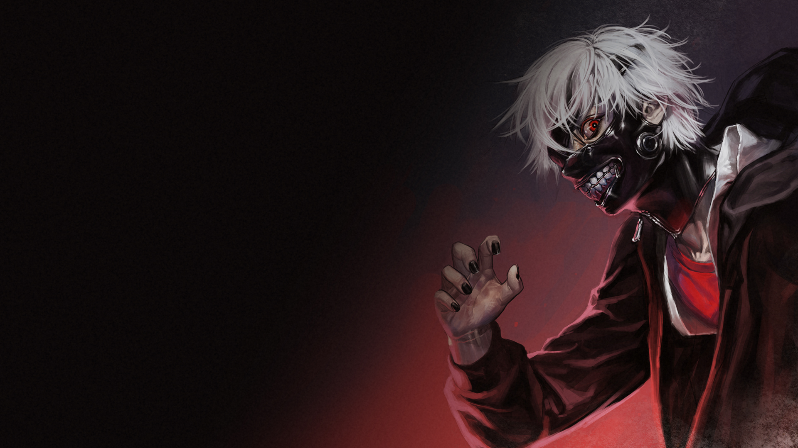

---
titleBreadcrumb: Home
...

Me-sida Kevin
===============================
Hej 
Detta är min me-sida för kursen [design](http://dbwebb.se/design) som jag läser på BTH (Blekinges Tekniska Högskola).

Jag heter Kevin är 21 år. Jag är uppväxt och bor fortfarande i Kristianstad men har planer om att flytta till Karlskrona. Jag bor med mina föräldrar och tre av mina syskon. Har totalt fem syskon två bröder och tre systrar, har även en hund. Kristianstad ligger ungefär en och en halv timme från Karlskrona så är tvungen att pendla till skolan medan jag letar lägenhet.

På gymnasiet studerade jag samhälle eftersom jag inte hade någon aning om vad jag ville bli. Fortfarande inte helt säker på vad jag vill bli. Men jag har ett intresse för datorer och tyckte programmering lät kul. Mina fritids intresse är bland annat spela dataspel, träna och hitta på random saker. När jag var liten tränade jag sporter som fotboll och tennis.
